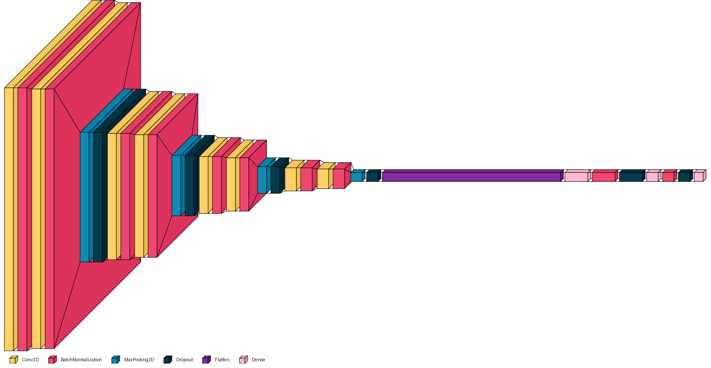

# CAT vs DOG Convolution Neural Network Classifier
這是一個卷積神經網路（CNN）分類器，用於分類貓與狗的圖片。用於訓練的圖片數量是20000張，驗證的圖片有5000張，最終使用2000張圖片測試。

使用的資料集是來自於[Kaggle的資料集](https://www.kaggle.com/datasets/karakaggle/kaggle-cat-vs-dog-dataset)

###  使用的工具與函式庫

本專案使用了以下 Python 函式庫與工具：

• Google Colab：作為雲端開發與訓練平台  
• NumPy：處理數值與矩陣運算  
• Matplotlib：圖像與訓練過程視覺化  
• TensorFlow / Keras：建立與訓練深度學習模型  
• scikit-learn：資料分割與模型評估（confusion matrix、classification report、ROC curve）  
• OpenCV（cv2）：處理與載入圖片  
• datetime、random、os：Python 標準函式庫  

###  Test-Train Split（測試訓練拆分）
本專案共使用 25,000 張圖像，包含兩個類別。
我將資料集依照比例 80% 作為訓練集，20% 作為驗證集。
也就是每個類別的圖像中，20,000 張用於訓練，5000 張用於驗證

### CNN 模型架構視覺化
以下為本專案中使用之卷積神經網路（CNN）模型架構圖，使用 `visualkeras` 套件視覺化呈現。該模型專為二分類任務（貓狗分類）設計，具備良好的特徵提取與分類能力。

###  模型架構說明：

- **輸入尺寸**：`150x150x3` 彩色影像
- **特徵提取層**：
  - 多層 `Conv2D` + `BatchNormalization` 提取空間特徵
  - `MaxPooling2D` 降低維度、保留關鍵特徵
  - `Dropout` 防止過擬合

- **分類層**：
  - 使用 `Flatten` 將特徵圖展平成向量
  - 接續兩層 `Dense` 全連接層，並搭配 `Dropout` 和 `BatchNormalization`
  - 最終輸出層為 `Dense(1)` + `sigmoid`，進行二元分類

### 設計特色：
- 利用漸進式擴大 Filter 數量（32→64→128→256）以捕捉不同層次的影像特徵
- 使用 `BatchNormalization` 穩定訓練過程並加速收斂
- 加入多層 `Dropout` 以強化模型泛化能力
