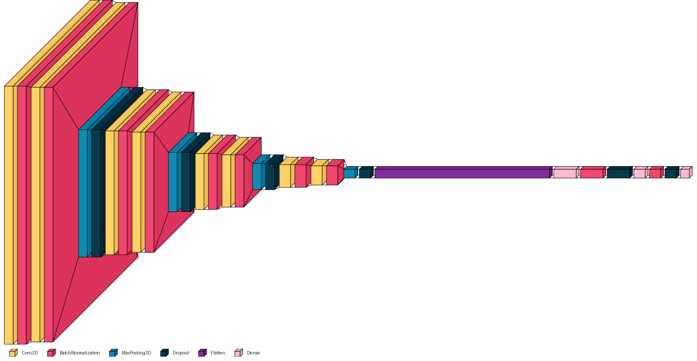
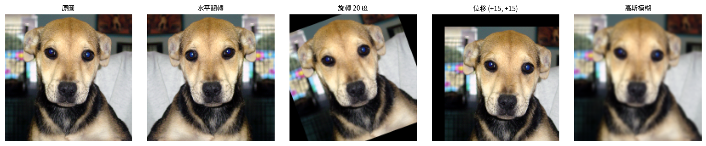
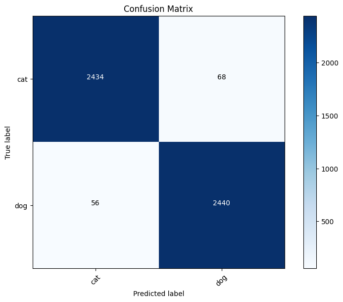
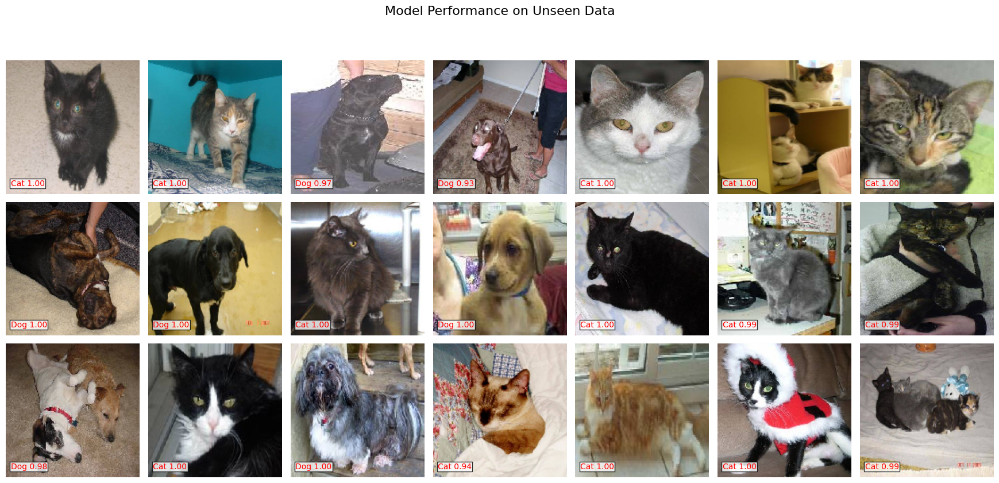

# CAT vs DOG Convolution Neural Network Classifier
這是一個卷積神經網路（CNN）分類器，用於分類貓與狗的圖片。用於訓練的圖片數量是20000張，驗證的圖片有5000張，最終使用2000張圖片測試。

使用的資料集是來自於[Kaggle的資料集](https://www.kaggle.com/datasets/karakaggle/kaggle-cat-vs-dog-dataset)

## 模型
[模型載點](https://drive.google.com/drive/folders/1HJD16NdZvSA1Hpud46s_eLusOaooMa42?usp=drive_link)
##  使用的工具與函式庫

本專案使用了以下 Python 函式庫與工具：

• Google Colab：作為雲端開發與訓練平台  
• NumPy：處理數值與矩陣運算  
• Matplotlib：圖像與訓練過程視覺化  
• TensorFlow / Keras：建立與訓練深度學習模型  
• scikit-learn：資料分割與模型評估（confusion matrix、classification report、ROC curve）  
• OpenCV（cv2）：處理與載入圖片  
• datetime、random、os：Python 標準函式庫  

##  Test-Train Split（測試訓練拆分）
本專案共使用 25,000 張圖像，包含兩個類別。
我將資料集依照比例 80% 作為訓練集，20% 作為驗證集。
也就是每個類別的圖像中，20,000 張用於訓練，5000 張用於驗證

### CNN 模型架構視覺化
以下為本專案中使用之卷積神經網路（CNN）模型架構圖，使用 `visualkeras` 套件視覺化呈現。該模型專為二分類任務（貓狗分類）設計，具備良好的特徵提取與分類能力。

##  模型架構說明：

- **輸入尺寸**：`150x150x3` 彩色影像
- **特徵提取層**：
  - 多層 `Conv2D` + `BatchNormalization` 提取空間特徵
  - `MaxPooling2D` 降低維度、保留關鍵特徵
  - `Dropout` 防止過擬合

- **分類層**：
  - 使用 `Flatten` 將特徵圖展平成向量
  - 接續兩層 `Dense` 全連接層，並搭配 `Dropout` 和 `BatchNormalization`
  - 最終輸出層為 `Dense(1)` + `sigmoid`，進行二元分類

## 設計特色：
- 利用漸進式擴大 Filter 數量（32→64→128→256）以捕捉不同層次的影像特徵
- 使用 `BatchNormalization` 穩定訓練過程並加速收斂
- 加入多層 `Dropout` 以強化模型泛化能力

## Data Augmentation 數據增強
使用數據增強技術來生成更多訓練資料，提升模型泛化能力。

•Shearing of images 圖像剪裁

•Random zoom 隨機縮放

•Horizontal flips 水平翻轉

•Rotation 旋轉

•Shift (width/height) 圖像平移

•Gaussian blur 高斯模糊（自定義）
<pre>
# 自定義模糊增強函數
def apply_random_blur(image):
    BLUR_PROBABILITY = 0.15
    MAX_BLUR_KERNEL_SIZE = 5
    if random.random() < BLUR_PROBABILITY:
        kernel_size = random.choice(range(1, MAX_BLUR_KERNEL_SIZE + 1, 2))
        if kernel_size > 1:
            try:
                if image.max() <= 1.0 and image.min() >= 0.0:
                    image_uint8 = (image * 255).astype(np.uint8)
                else:
                    image_uint8 = image.astype(np.uint8)
                blurred_image_uint8 = cv2.GaussianBlur(image_uint8, (kernel_size, kernel_size), 0)
                if image.max() <= 1.0 and image.min() >= 0.0:
                    image = blurred_image_uint8.astype(np.float32) / 255.0
                else:
                    image = blurred_image_uint8.astype(np.float32)
            except Exception as e:
                print(f"模糊失敗: {e}")
    return image

# 定義資料增強器
train_datagen = ImageDataGenerator(
    rescale=1./255,
    rotation_range=20,
    width_shift_range=0.1,
    height_shift_range=0.1,
    shear_range=0.1,
    zoom_range=0.1,
    horizontal_flip=True,
    fill_mode='nearest',
    preprocessing_function=apply_random_blur
)
                  </pre>

## Prediction of Single Image 單一圖像的預測
<pre>
# 預測
prob = model.predict(img_array)[0][0]
label = "Dog" if prob > 0.5 else "Cat"
confidence = prob if prob > 0.5 else 1 - prob

# 顯示圖片與結果
plt.imshow(img)
plt.axis('off')
plt.title(f"{label} {confidence:.2f}", fontsize=16, color='red')
plt.show()
</pre>
.png) 
.png)

## Confusion Matrix 混淆矩陣
 

## Model Performance on Unseen Data 陌生圖片上的模型性能
 

## Conclusion  結論

本專案成功建立了一個卷積神經網路（CNN）模型，能夠有效辨識貓與狗的圖像。透過資料正規化與隨機模糊等資料增強技術，提升了模型的泛化能力。在測試集上，模型達到 97.52% 的準確率

預測結果以圖片標註的方式呈現，輸出類別為「Dog」或「Cat」，並搭配對應的信心分數（Confidence Score），例如 Dog 0.98，方便使用者直觀理解分類結果。

